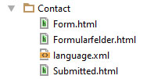

# Teamgeist Formhandler Template-Builder

Liefert Standard Formulare und Funktionen zur schnellen Erstellung von Formularen

## Inhalte

* [Installation](#install)
* [Neue Formulare erstellen](#getstartet)
* [Templating](#templating)
  * [Felder und Konfiguration](#fieldsettings)
  * [Fieldgroups & Fieldsets](#groups)
* [Submitted & Mail Templates](#submitted)
* [Javascript Validierung, Datepicker und Features](#javascript)
* [Backbone](#backbone)


## Voraussetzungen

* TYPO3 7.6
* vhs ViewHelper
* [Formvalidation.io](http://formvalidation.io/)
* opt. [Bootstrap Datepicker](https://bootstrap-datepicker.readthedocs.io/)

## <a id="install"></a> Installation

1. Dieses Repository als ZIP herunterladen oder clonen und installieren
2. Statisches Typoscript einbinden (danach stehen Standardformulare bereit)

## <a id="getstartet"></a> Erstellung eines neuen Formulars "Beispielformular"

1. Ordner des Beispielformulars "Contact" in fileadmin übernehmen (Pfad kann per Konstante angepasst werden)
2. Der Ordner des neuen Templates muss großgeschrieben sein etwa fileadmin/tgm_pitb/_global/tmpl/ext/formhandler/**Beispielformular**
3. Typoscript (Pfad zu den Templates wird anhand der uniqueFormID automatisch gefunden)

```typoscript
plugin.Tx_Formhandler.settings.predef.tmplbuilder-contact < plugin.tx_tgmformhandlertmplbuilder
plugin.Tx_Formhandler.settings.predef.tmplbuilder-contact {
	# Ohne Leerzeichen!
	uniqueFormID.10.formname = Beispielformular
	name = Beispielformular Name im Plugin
}
```

4. Formhandler "Plugin" einbinden und Formular benutzten

## <a id="templating"></a> Templating



Pro Formular gibt es maximal vier Dateien.

1. Eine optionale Sprachdatei.

   Feldnamen und Index müssen übereinstimmen um Labels ordnungsgemäß zu erzeugen.
   Häufig verwendete Felder sind in der shared.xml der Extension vorhanden.

2. Formularfelder.html (Partial)

   Für das Formular und Submitted sowie Mailtemplates verwendete Datei in der alle Felder erstellt werden. Siehe Formularerstellung.

3. Form.html

   Wrappt das Form Tag um Formularfelder.html

4. Submitted.html

   Submitted und Mail Templates anhand von Formularfelder.html.

## Formularerstellung

Alle Formularfelder werden in Formularfelder.html erstellt. Pro Feldtyp gibt es im Hintergrund Partials die anhand der übergebenen
Parameter das Formularfeld rendern.

**Beispiel**
```html
<f:render partial="Select"
    arguments="{fieldname: 'anrede', options: {0: 'herr', 1: 'frau'}, field-size: 'col-md-6', label-size: 'col-md-6', required: 1, prepend: ' '}" />
```

### <a id="fieldsettings"></a> Typen & Argumente

Die folgenden Formularfelder existieren:

* Input
* Textarea
* Checkbox
* Radio
* Select
* Submit

**Argumente**

| Argument | Beschreibung | Typen | Default
---|---|---|---
fieldname | Der Feldname anhand dessen auch das Label aus der LLL Datei geholt wird | alle
field-size | Bootstrap Klasse und / oder weitere Klassen die dem Feld hinzugefügt werden | alle | col-md-12
label-size | Siehe field-size. Label **nur sichtbar** wenn angegeben. | alle |
options | Array mit den möglichen Auswahlmöglichkeiten (Beispiel s.o.). Pro Wert **muss** das entsprechende Label in der Sprachdatei existieren. | select, radio, checkbox
prepend | Auswahlmöglichkeit ála "bitte wählen". | select | `###LLL:bittewaehlen###`
noPrepend | Verhindert ein leeres Selectfeld, sodass automatisch erster Wert | select | 
class | Zusätzliche CSS-Klasse fürs Formularfeld | input, select, textarea
required | Pflichtfeld? | alle
readonly | Nur lesen? | **nicht** checkbox und radio
placeholder | Platzhalter im Feld. **USE-LABEL** Keyword nutzt Text aus Sprachdatei | input, textarea
tooltip | Tooltip Text neben dem Label | alle
tooltip-icon | Glyphicon des Tooltip Hovers | alle | info-sign
requiredSign | Required Zeichen des Felder | alle | *
inputAddon | Bootstrap Input-Addon neben dem Feld (z.B. Text oder ein Glphyicon) | input
data-tags | Array mit data-Tags fürs Formularfeld | input, textarea
requires-field | Feldname von dem die Sichtbarkeit dieses Feldes abhängig ist | input, textarea
requires-value | Wert des benötigten Feldes damit das Feld sichtbar wird | input, textarea
btnClass | CSS-Klasse des Buttons | submit | btn-primary
glyphicon | Icon im Submit Button | submit | glyphicon-circle-arrow-right

## <a id="groups"></a> Fieldgroups und Fieldsets

Der ViewHelper `<t:wrap>` wird eingesetzt um Bereiche in Fieldsets und Fieldgroups zu Wrappen.
Dies ist notwendig um unzulässige Tags aus dem Submitted / Mail Templates zu entfernen (siehe ViewHelper).

**Fieldset**

`<t:wrap partial="Fieldset" arguments="{legend: 'Meine Legende'}" >`

**Fieldgroup**

`<t:wrap partial="FieldGroup" arguments="{field-size:'col-md-12'}" >`

Fieldgroups können verwendet werden um mehrere Bilder in einer "row" darzustellen. Das Argument "field-size"
gibt hierbei die Breite der gesamten Gruppe an. Innerhalb des "wraps" können die üblichen Bootstrap Grid-Klassen verwendet
werden um die Felder nebeneinander auszurichten. (row / col-md-4 etc.)


## <a id="submitted"></a>Submitted & Mail-Templates

In der Datei Submitted.html wird das Formularfelder-"Partial" gerendet. Durch den ViewHelper `<t:wrap>` und
`<t:betterStripTags>` wird das gesamte Formular zu einer Tabelle umformatiert. Dazu werden in Submitted.html andere Partials für
alle Formularfelder verwendet, welche Felder inkl. deren Werte tabellarisch anordnen.

## Javascript Validierung, Datepicker und Features

Zur Validierung des Formulars wird formvalidation.io verwendet.

Durch das hinzufügen der CSS-Klasse "date" wird der Bootstrap Datepicker automatisch auf entsprechenden Felder aktivert.

### <a id="javascript"></a>Conditional-Logic von Feldern

Die Attribute **"requires-field" und "requires-value"** welche für Input und Textarea-Felder zur Verfügung stehen können auch auf beliebige DOM-Elemente verwendet werden um diese entsprechend auszublenden.

DOM-Elementen kann außerdem **data-pitb-requires-area=".jquerySelector"** gegeben werden um beispielsweise
zwei Bereiche von einander abhängig zu machen, sodass die Validierung in einem Bereich deaktiviert wird, sobald der
andere vollständig valide ist.

## <a id="backbone"></a>Backbone

### Form / Submitted Partials
In Form.html und Submitted.html werden für Felder unterschiedliche Partials verwendet (Partials/Submitted & Partials/Form).
In den Konstanten kann für diese ein alternative Pfad hinterlegt werden um diese zu modifzieren.
